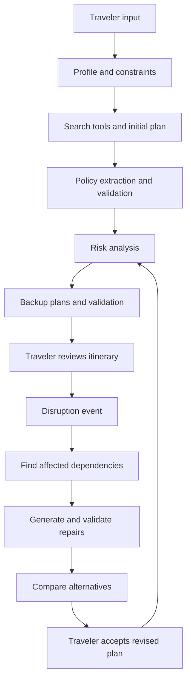

# Travel Disruption Replanner

**Personalized travel planning, proactive backup plans, and disruption-aware replanning.**

Travel Disruption Replanner is a proposed AI travel assistant that helps travelers build a trip within their budget, prepare alternatives before departure, and adjust affected plans when something changes. It considers the whole itinerary: a delayed flight can affect a rental car pickup, hotel check-in, dinner reservation, and the following day's activities.

> **Project status:** Planning and design. This repository currently contains project documentation, not a runnable application. Features, components, and directory layouts below describe the intended implementation. The first milestone uses mock travel data, simulated disruptions, and mock advertisements.

## Documentation

- [Architecture and LLM inputs](docs/ARCHITECTURE.md): agents, orchestration, data contracts, validation, and replanning.
- [Product scope and roadmap](docs/ROADMAP.md): MVP boundaries, acceptance criteria, future work, and open decisions.
- [Data integrations](docs/DATA_SOURCES.md): candidate providers, limitations, and mock-to-live integration strategy.
- [Contributing](CONTRIBUTING.md): component ownership, development workflow, and review expectations.

## What the app is designed to do

| Capability | Intended behavior |
| --- | --- |
| Budget-aware planning | Build an itinerary using the traveler's total budget, category preferences, and contingency reserve. Account for known taxes and fees and identify estimates. |
| Personalization and filters | Consider dining preferences, dietary restrictions, children, pets, interests, travel pace, and accessibility needs. Distinguish mandatory requirements from preferences. |
| Itinerary optimization | Balance travel time, opening hours, cost, and experience quality while respecting hard constraints. |
| Risk detection | Flag tight connections, weather-sensitive activities, long drives, limited opening hours, and financial exposure from restrictive bookings. |
| Proactive backup planning | Prepare Plan B and Plan C for vulnerable activities or connected groups of bookings before the trip. |
| Real-time replanning | Respond to delays, cancellations, closures, weather changes, or a traveler's change of plans. The MVP uses simulated events; live monitoring comes later. |
| Dependency-aware repair | Repair the affected portion of the itinerary and check its effects on downstream bookings while preserving feasible plans. |
| Alternative comparison | Explain differences in additional cost, refund loss, travel time, convenience, and experience fit. |
| Refund-policy awareness | Summarize booking-specific cancellation terms, deadlines, fees, and uncertainties with links to source evidence. |
| Trip memory and feedback | Remember approved preferences and use feedback such as “not interested” to improve suggestions. |

Insurance preferences and disruption-claim assistance are part of the longer-term product vision. Travelers should be able to express preferences such as no insurance, flight coverage only, hotel coverage only, or both. A preference is not purchased coverage. Future claim support would assemble policy evidence and draft claim materials for review; eligibility and reimbursement must not be assumed.

## Example journey

1. A family enters trip dates, a $2,000 budget, one child's age, a pet, vegetarian dining preferences, and an interest in museums and outdoor activities.
2. The planner proposes a feasible itinerary and shows how much budget remains.
3. The risk analyzer flags an outdoor activity and a tight arrival-day schedule. The backup planner prepares indoor alternatives and a later dinner option.
4. A simulated flight delay changes the arrival time. The app checks transport, hotel check-in, and dinner dependencies.
5. The traveler compares valid replacements, sees the costs and cancellation consequences, and accepts a revised itinerary.

Backup suggestions are not reservations. Availability, prices, and terms must be checked again before selection. In the MVP, accepting a plan changes only the simulated itinerary.

## Proposed workflow



The orchestrator is deterministic application code. LLMs interpret preferences, propose plans, and explain tradeoffs; code validates constraints and calculates money and time. See the [architecture guide](docs/ARCHITECTURE.md) for details.

## Team ownership

Assign one primary owner to each component to reduce overlapping edits. Person numbers are placeholders until the team assigns names.

| Person | Owns | Proposed directories |
| --- | --- | --- |
| 1 — Integrator | Shared schemas, orchestration walkers, ConstraintValidator, CI | `schema/`, `walkers/`, `validate/`, `.github/` |
| 2 | ProfileAgent, profile filtering, place tagging, budget ledger | `profile/`, `filter/`, `budget/` |
| 3 | PlannerAgent and tool adapters, starting with mocks | `planner/`, `tools/` |
| 4 | PolicyAgent, RiskAnalyzer, BackupAgent, cancellation tracker | `policy/`, `risk/`, `backup/` |
| 5 | ReplanAgent, ComparatorAgent, disruption simulator, UI | `replan/`, `compare/`, `ui/` |

These directories are proposed boundaries, not existing application modules. Shared contract changes should be coordinated with the integrator before dependent work begins.

## Advertising and sponsorships

The prototype will show clearly labeled mock ads. The proposed ranking policy is that sponsorship revenue has **zero weight in organic recommendations**. Sponsored placements should appear separately, be labeled, and meet the same relevant eligibility requirements as other options.

Evaluate sponsorships by incremental revenue alongside user trust, complaint rates, recommendation quality, and constraint failures. A commercial request for higher organic ranking should be declined under this proposed policy. The team should approve the monetization policy before introducing real sponsorships.

## Getting started

```bash
git clone https://github.com/howarddong0485/Travel-Disruption-Replanner.git
cd Travel-Disruption-Replanner
```

Read the architecture and roadmap, agree on the shared contracts, and assign component owners. A language, framework, LLM provider, storage layer, and deployment target have not yet been selected; installation and run instructions will be added when an executable prototype exists.

The recommended first deliverable is one complete flow using fixture data: **profile → plan → validate → risks → backups → simulated disruption → repair → compare**.

## License

No license has been selected or added yet. The team should choose one before inviting external reuse.
