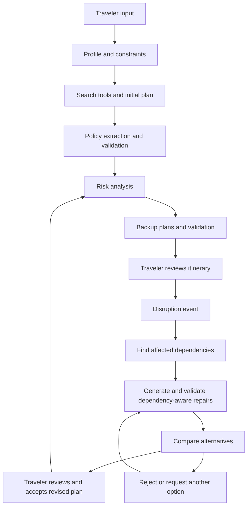

# Travel Disruption Replanner

**Personalized travel planning, proactive backup plans, and disruption-aware replanning.**

Travel Disruption Replanner is a proposed AI travel assistant that helps travelers build a trip within their budget, prepare alternatives before departure, and adjust affected plans when something changes. It considers the whole itinerary: a delayed flight can affect a rental car pickup, hotel check-in, dinner reservation, and the following day's activities.

> **Project status:** Planning and design. This repository currently contains project documentation, not a runnable application. Features, components, and directory layouts below describe the intended implementation. The first milestone uses mock travel data, simulated disruptions, and mock advertisements.

## Documentation

- [Architecture and LLM inputs](docs/ARCHITECTURE.md): agents, orchestration, data contracts, validation, and replanning.
- [Product scope and roadmap](docs/ROADMAP.md): MVP boundaries, acceptance criteria, future work, and open decisions.
- [Data integrations](docs/DATA_SOURCES.md): candidate providers, limitations, and mock-to-live integration strategy.
- [Contributing](CONTRIBUTING.md): component ownership, development workflow, and review expectations.

## Key features (MVP)

| Capability | Intended behavior |
| --- | --- |
| Personalized, Budget- and Constraint-Aware Planning | Collect the current trip profile and generate an itinerary within the budget, accounting for known taxes/fees, contingency, opening hours, and travel time. Dietary, pet, child, and accessibility requirements are core hard filters; distinguish them from soft preferences and surface missing eligibility evidence. |
| Risk and Cancellation Awareness | Identify tight connections, weather-sensitive activities, long drives, limited hours, and restrictive bookings. Explain the affected items, supporting evidence, cancellation deadlines/fees, and possible mitigations; leave uncertain refund terms unknown. |
| Proactive Backup Planning | Prepare validated Plan B/C options for vulnerable itinerary items or connected bookings before departure. Show activation conditions, checked time, and estimated costs; backups are suggestions, not reservations, and require refreshed evidence before selection. |
| Disruption-Triggered, Dependency-Aware Replanning | After a delay, cancellation, weather change, closure, or traveler change, check downstream hotel, rental-car, restaurant, attraction, and transport dependencies and repair the affected portion while preserving feasible unaffected and traveler-fixed items. All replacements must still satisfy hard constraints. The MVP uses simulated or traveler-reported events; automatic live monitoring comes later. |
| Transparent Alternative Comparison | Compare valid alternatives separately by additional cash needed now, refund loss, projected total trip cost, travel time, convenience, and subjective experience fit. Explain tradeoffs and uncertainties without double counting original payments; comparison applies to both proactive backups and disruption repairs. |
| Traveler Review and Plan Control | Show the proposed changes and reasons, let travelers mark arrangements to keep, reject a suggestion or request a replacement, and explicitly accept a revised plan. Report conflicts with fixed items. Rejection leaves the current itinerary unchanged; acceptance updates only simulated trip state in the MVP. |

## Supplemental features

These extend the core workflow and are not prerequisites for a feasible MVP trip.

- **Consented Cross-Trip Memory:** Save approved preferences across trips with correction and deletion controls. Current-trip profile intake is a core feature and does not depend on long-term memory.
- **Advanced Preference Modes:** Offer optional travel-style presets and richer soft-preference filters beyond the mandatory dietary, pet, child, and accessibility checks included in core planning.
- **Expanded Landmark Discovery:** Offer deeper interest-based exploration and optional landmark suggestions beyond the basic interest matching included in core planning.
- **Long-Term Preference Learning:** Use consented feedback across trips to improve future recommendations. Basic “not interested” feedback and requesting a replacement are core interactions.

Insurance preferences and disruption-claim assistance are part of the longer-term product vision. Travelers should be able to express preferences such as no insurance, flight coverage only, hotel coverage only, or both. A preference is not purchased coverage. Future claim support would assemble policy evidence and draft claim materials for review; eligibility and reimbursement must not be assumed.

## Example journey

1. A family enters trip dates, a $2,000 budget, one child's age, a pet, vegetarian dining preferences, and an interest in museums and outdoor activities.
2. The planner proposes a feasible itinerary and shows how much budget remains.
3. The risk analyzer flags an outdoor activity and a tight arrival-day schedule. The backup planner prepares indoor alternatives and a later dinner option.
4. A simulated flight delay changes the arrival time. The app checks transport, hotel check-in, and dinner dependencies.
5. The traveler compares valid replacements, sees separate cash needs, refund loss, and projected total cost, and reviews the exact changes. They can keep important arrangements, reject an option, or accept a revised itinerary.

Backup suggestions are not reservations. Availability, prices, and terms must be checked again before selection. In the MVP, accepting a plan changes only the simulated itinerary.

## Proposed workflow



The orchestrator is deterministic application code. LLMs interpret preferences, propose plans, and explain tradeoffs; code validates constraints and calculates money and time. See the [architecture guide](docs/ARCHITECTURE.md) for details.

## Team ownership

The basic travel planner is a shared foundation, built first by a temporary lead or pair as a separately scoped task. It accepts basic trip inputs, generates an initial itinerary from mock data, and provides a minimal itinerary view. This foundation task does not occupy one of the five ongoing feature-owner assignments.

Person numbers are placeholders until the team assigns names.

| Person | Owns | Proposed directories |
| --- | --- | --- |
| 1 | Personalization and feasibility: ProfileAgent, mandatory filters, budget ledger, ConstraintValidator, and profile/constraint UI | `profile/`, `filter/`, `budget/`, `validate/` |
| 2 | Policies and risk detection: PolicyAgent, cancellation tracking, RiskAnalyzer, source evidence, and risk/policy UI | `policy/`, `risk/` |
| 3 | Proactive backup planning: BackupAgent, alternative search/refresh adapters, validated Plan B/C options, and backup UI | `backup/`, `tools/alternatives/` |
| 4 | Disruption and dependency-aware replanning: ReplanAgent, disruption simulator, dependency traversal, version-safe patch application, and disruption UI | `replan/`, `events/` |
| 5 | Comparison and traveler control: ComparatorAgent, comparison explanations, review/accept/reject interactions, and shared page shell | `compare/`, `ui/review/`, `ui/shell/` |

Each feature owner owns its logic, feature-specific UI components, tests, and integration. Modules develop independently against agreed inputs/outputs and shared fixtures; runtime dependencies go through those interfaces. Person 5 owns the review UI and page shell, not every feature's UI.

Person 1 supplies the authoritative budget and feasibility calculations; Person 2 supplies evidenced policy/refund rules; Person 5 consumes these outputs instead of duplicating monetary logic. Person 4 owns patch application and trip-version checks; Person 5 calls that interface only after explicit traveler acceptance.

Assign one named owner at a time to shared schemas, orchestration walkers, common tool adapters, fixtures, and CI. The integration role may rotate by phase and is not permanently assigned to Person 1. Shared contract changes require coordination with affected owners. Proposed directories describe future boundaries; the application is not yet implemented.

## Advertising and sponsorships

The prototype will show clearly labeled mock ads. The proposed ranking policy is that sponsorship revenue has **zero weight in organic recommendations**. Sponsored placements should appear separately, be labeled, and meet the same relevant eligibility requirements as other options.

Evaluate sponsorships by incremental revenue alongside user trust, complaint rates, recommendation quality, and constraint failures. A commercial request for higher organic ranking should be declined under this proposed policy. The team should approve the monetization policy before introducing real sponsorships.

## Getting started

```bash
git clone https://github.com/howarddong0485/Travel-Disruption-Replanner.git
cd Travel-Disruption-Replanner
```

Read the architecture and roadmap, agree on the shared contracts, and assign component owners. A language, framework, LLM provider, storage layer, and deployment target have not yet been selected; installation and run instructions will be added when an executable prototype exists.

The recommended first deliverable is one complete flow using fixture data: **profile and hard filters → plan → validate → risks → backups → simulated disruption → dependency-aware repair → compare → traveler review and acceptance**.

## License

No license has been selected or added yet. The team should choose one before inviting external reuse.
